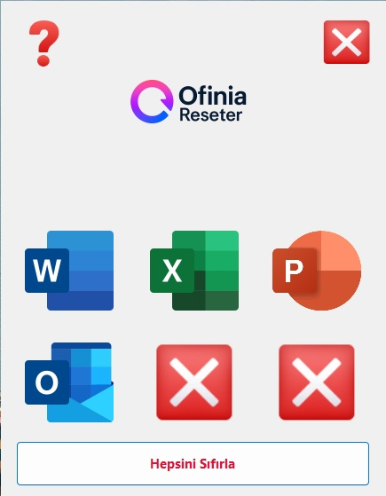
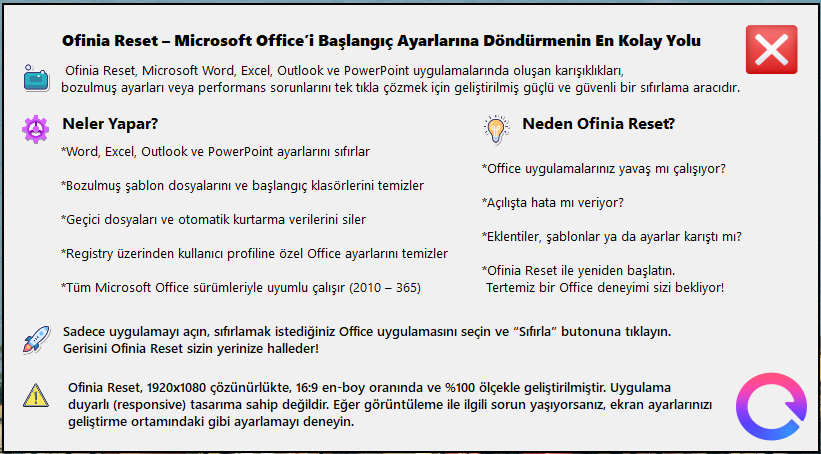

# 🌀 Ofinia Reseter

**Office Uygulamalarınızı Sıfırlayın. Çalışma Alanınızı Yenileyin.**

Ofinia Reseter, Microsoft Office uygulamalarını (Word, Excel, PowerPoint, Outlook) fabrika ayarlarına döndürmek için geliştirilmiş, hafif ve kullanıcı dostu bir masaüstü aracıdır.

> 🧽 Sorun giderme yaparken ya da temiz bir başlangıca ihtiyaç duyduğunuzda, Ofinia Reseter sizin için hızlı, güvenli ve kolay bir çözümdür.

---

## ✨ Özellikler

- 🔄 **Word, Excel, PowerPoint ve Outlook’u sıfırlama**
- 💡 Tüm Microsoft Office sürümleriyle uyumlu
- 💻 Basit ve modern arayüz
- 🚫 İnternet bağlantısı veya veri takibi yok

---

## 📸 Ekran Görüntüleri

<!-- Görselleri buraya ekleyebilirsiniz -->

  

  

---

## 🧩 Desteklenen Office Sürümleri

- Microsoft Office 2010, 2013, 2016, 2019, 2021  
- Microsoft 365 (masaüstü sürümü)

---

## 🖥️ Kurulum

En son sürümü [Releases](https://github.com/kullaniciadiniz/ofinia-reseter/releases) bölümünden indirebilirsiniz.

